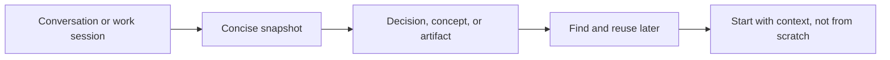
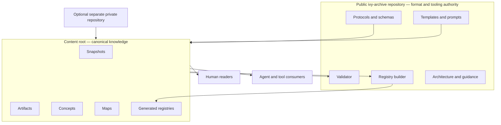

# Ivy — The Archive

Ivy is a small, repo-backed system for turning conversations, decisions, and working notes into reusable knowledge. It is for people and teams who want durable context without locking it inside a chat product: canonical objects are Markdown, Git provides history and backup, and lightweight Python tooling checks structure and builds searchable CSV registries.

Ivy is an early, working design (draft v1), not a published application or package. The schemas, templates, validator, and registry builder are implemented. Automated capture, richer retrieval, and integrations described in historical material remain exploratory.

## Why it matters



Ivy keeps the useful structure of prior thinking—not raw transcripts—and makes it portable across tools, models, and collaborators.

## Five-minute first snapshot

Requirements: Git and Python 3.7 or newer. The scripts use only the Python standard library; there is no dependency install step.

```bash
git clone https://github.com/dhk/ivy-archive.git
cd ivy-archive
python3 scripts/validate.py

cp templates/snapshot.md snapshots/2026-08-09__example__first-snapshot.md
```

Edit the copied file before validating:

1. Replace `SNAP-YYYY-MM-DD-SLUG` with a lowercase ID such as `snap-2026-08-09-first-snapshot`.
2. Set `date`, `created_at`, and `updated_at` to truthful ISO-formatted values.
3. Replace the example title, topic, project, and empty section bodies. Keep every required heading exactly once.
4. Set `visibility` deliberately. In a public checkout, use only content that is safe to publish.

Then run:

```bash
python3 scripts/validate.py
python3 scripts/build_registry.py
git diff -- registry/
```

Validation should report the number of valid canonical files. Registry generation rewrites the five CSVs in `registry/`; review and commit those changes with the object. If validation fails, fix every listed file and rerun both commands. Do not hand-edit generated CSVs.

## Architecture and authority



This repository owns Ivy's format: schemas, templates, prompts, validation, registry generation, and architecture. A separate private repository, when used, owns only sensitive canonical content and its generated registries. It should consume the public tooling at a pinned revision rather than copy schemas or scripts. The `visibility` field is classification metadata, not access control; repository permissions are the security boundary.

Canonical rules have one home:

- [`docs/spec.md`](docs/spec.md) defines the system and storage model.
- [`protocols/snapshot-schema.md`](protocols/snapshot-schema.md) defines snapshot fields, enums, IDs, filenames, and sections.
- `scripts/validate.py` is the executable validation authority; [`protocols/validation-rules.md`](protocols/validation-rules.md) explains its checks.
- [`docs/ivy-design.md`](docs/ivy-design.md) explains architecture and data flow.

## Three supported ways to use Ivy

### 1. Clone and use the repository

Use the first-run workflow above. The included canonical objects are public, non-sensitive examples and design history. Inventory is generated in `registry/`, so counts are not duplicated here.

### 2. Pin the tooling

For repeatable use, clone the repository and check out a reviewed tag or commit:

```bash
git clone https://github.com/dhk/ivy-archive.git ivy-tooling
cd ivy-tooling
git checkout <reviewed-tag-or-commit>
```

Record that revision alongside the content using it. Ivy is not published to PyPI or npm; do not rely on a package install command.

### 3. Use a separate private content root

Keep the public tooling checkout and private content checkout as siblings, then point the scripts at the content root using a relative path:

```bash
cd ivy-tooling
IVY_CONTENT_ROOT=../private-content python3 scripts/validate.py
IVY_CONTENT_ROOT=../private-content python3 scripts/build_registry.py
```

The content root must contain canonical `snapshots/`, `concepts/`, `artifacts/`, and `maps/` directories as needed. Registry files are written to `<content-root>/registry/`. Do not copy public schemas, templates, or scripts into the private repository; pin the public revision instead.

## Safe operation and recovery

- Treat `private`, `sensitive`, and `needs-review` as non-public. Never move content into a public remote merely because metadata labels it private.
- Validate and inspect `git diff` before every commit. Search staged changes for secrets and personal data; if sensitive data reaches Git history, revoke exposed credentials first and follow the host's history-removal procedure.
- Registry files are derived. If they conflict or become stale, discard only the registry edits, rerun `scripts/build_registry.py`, and review the result.
- Keep at least one backup outside the working checkout. For private content, use an access-controlled remote or encrypted backup and periodically test restoration into a temporary directory.
- If a tooling update breaks validation, return to the recorded working revision, preserve the content, and investigate on a branch. Never “fix” content by deleting it.

See [`SECURITY.md`](SECURITY.md) for reporting and private-data handling, and [`docs/contributor-guide.md`](docs/contributor-guide.md) for contribution expectations.

## Repository map

| Path | Role |
|---|---|
| `protocols/` | Canonical schema and validation contracts |
| `templates/` | Starting points for canonical objects |
| `prompts/` | Capture, handoff, map, and session prompts |
| `scripts/` | Standard-library validator and registry builder |
| `snapshots/`, `concepts/`, `artifacts/`, `maps/` | Public-safe canonical content in this checkout |
| `registry/` | Generated indexes; committed and rebuilt after content changes |
| `docs/` | Architecture, use, contribution, and playbooks |
| `code/skills/` | Experimental integration source, not required for the core workflow |

## Project status and licence

Ivy is a draft public project. Contributions are welcome through issues and pull requests, subject to the validation and privacy checks in the contributor guide. No licence file is currently present, so copyright defaults apply; public availability alone does not grant permission to copy, modify, or redistribute the project.
