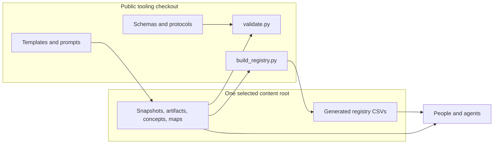

# Ivy architecture

Status: draft v1.3

## Purpose

Ivy separates a stable public format and toolchain from the knowledge stored in that format. This document is the architecture authority; field-level rules live in [`../protocols/snapshot-schema.md`](../protocols/snapshot-schema.md), and executable validation lives in `scripts/validate.py`.

## Components and data flow



The content root may be this public repository or a separate access-controlled repository. `IVY_CONTENT_ROOT` selects it at process start; without that variable, the tooling repository is the content root. `IVY_REGISTRY_ROOT` is an advanced override for registry output, but the normal and documented policy is to keep registries inside the selected content root.

## Authority boundary

The public repository owns:

- object schemas, enums, naming, and lifecycle rules;
- templates and prompts;
- validation and registry-generation behavior;
- architecture and contributor guidance.

An optional private repository owns:

- sensitive canonical objects;
- the registries generated from those objects;
- access policy, backups, and retention for that content.

The private content repository must not become a parallel format authority. It should pin a reviewed public commit or tag and run that checkout's tools with `IVY_CONTENT_ROOT`. Local operational configuration may live privately, but schemas, validators, and generic prompts should be improved in public.

## Storage invariants

Each canonical object has exactly one home under `snapshots/`, `concepts/`, `artifacts/`, or `maps/`. Visibility is stored in frontmatter rather than encoded in folders. This makes objects portable, but it does not make a public repository safe for sensitive data: Git permissions and the selected remote provide access control.

Markdown files are authoritative. Registry CSVs are disposable projections that are fully rewritten. Consumers may use registries for discovery but must resolve the canonical Markdown object for content.

## Deployment shapes

### Public-only

The repository root is both toolkit and content root. This is appropriate only for public-safe content.

### Public toolkit plus private content

```text
workspace/
  ivy-tooling/       # public checkout pinned to a reviewed revision
  private-content/   # access-controlled canonical content and registry
```

From `ivy-tooling/`:

```bash
IVY_CONTENT_ROOT=../private-content python3 scripts/validate.py
IVY_CONTENT_ROOT=../private-content python3 scripts/build_registry.py
```

This is one format authority operating on a different content root, not two implementations.

## Trust and failure model

- Frontmatter visibility is classification metadata. It cannot prevent disclosure.
- Validation catches structural errors, duplicate IDs, bad enums, misplaced objects, and unresolved references; it does not detect secrets or judge whether prose is safe to publish.
- Registry generation overwrites derived CSVs. Review its diff and regenerate after every canonical content change.
- Pinning the toolkit prevents an unreviewed schema change from unexpectedly changing a private archive.
- Git history and an independent, access-controlled or encrypted backup provide recovery. A restoration test is part of backup maintenance.

## Maturity

The Markdown model, templates, validator, content-root override, and CSV builder are implemented. CI enforcement, packaging, automated migration, semantic search, and integrations are not part of the core v1 contract. There is no PyPI or npm distribution.
